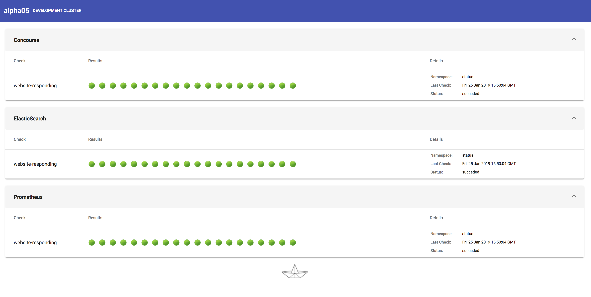

# kstatus

I needed a quick way of checking the status of the different applications running in my cluster. I wanted to have a very easy and simple way of adding/removing health checks and I didn't want to reinvent the wheel, so I've used the Kubernetes `CronJobs` to schedule and launch the different application checks.

The frontend consumes a REST api that queries the `Job` objects in the API Server and returns the last 20 checks.

By adding/removing labels in the jobs we add/remove applications into the Status Page application.


For example, the following `CronJob` will check every 5 minutes if ElasticSearch is responding

```
apiVersion: batch/v1beta1
kind: CronJob
metadata:
  name: elastic-web-check
  labels:
    run: "website-responding"
    app: elastic-check-web
    group: ElasticSearch
spec:
  concurrencyPolicy: Forbid
  schedule: "*/5 * * * *"
  successfulJobsHistoryLimit: 20
  failedJobsHistoryLimit: 20
  jobTemplate:
    spec:
      backoffLimit: 0
      activeDeadlineSeconds: 300 # 5min
      template:
        metadata: 
          labels:
            run: "website-responding"
            app: elastic-check-web
            group: ElasticSearch
        spec:
          containers:
            - name: curl
              image: appropriate/curl
              command: ["/bin/sh"]
              args: ["-c", "curl -s -o /dev/null -I -w \"%{http_code}\" http://mon-es-elasticsearch-client.monitor.svc.cluster.local:9200"]
          restartPolicy: Never
```

by runnning these jobs, the Status application will pick it up and display it. Here there's a screenshot illustrating the result:


